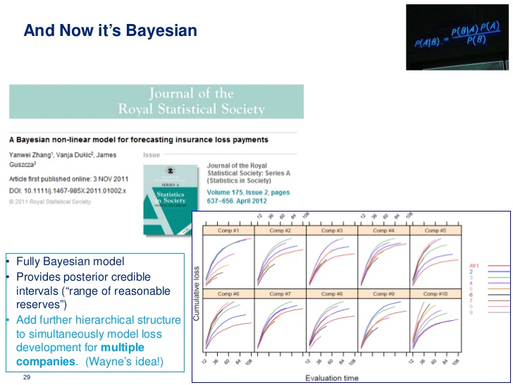

# STSCI 4780 Lab 1

**Jan 29, 2015**

My name is Tong Lu. I am a master's degree student in the MPS in Applied Statistics program. The anticipated graduation date for me is May, 2015.

I haven't taken a course in Bayesian theory, but a few courses and projects do involve Bayesian modeling. One example is to calculate the premium for a new insured driver without sufficient previous driving records.  

Incorporating Bayesian modeling, a prior distribution of the potential loss for a newly insured person may refer to the distribution of loss from his belonging group, possibly determined by his age, income, and educational level. As the driving period grows, the posterior distribution of loss for that person can be adjusted by taking account in his driving records, such as claims and driving habits.

The following is a graph illustration:

From my experience with Bayesian, I am interested in its modeling idea in which we treat the underlying population as a variable rather than a fixed one from a tradition perspective. 

